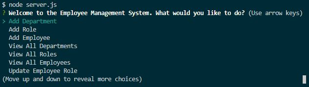

  # Employee Management System

  Table of Contents: 
  

  [Description](#description)
  

  [Usage](#usage)
  

  [License](#license)
  

  [Contributing](#contributing)
  

  [Test](#test)
  

  [Questions](#questions)

  ## Description:
  

  CLI program utilizing inquirer and mysql npm modules to add and edit information in a department store database 

  ## Installation:
  
 
  Requires inquirer and mysql npm modules to be installed before running

  ## Usage:
  

  After installing the npm dependencies, run using command "node server.js" in the command line. 

  ## License:
  

  CC0 - Creative Commons 

  ## Contributing:
  

  None needed at this time

  ## Test:
  

  N/A

  ## Questions:
  [My Github](https://github.com/ajper05)

  

  

